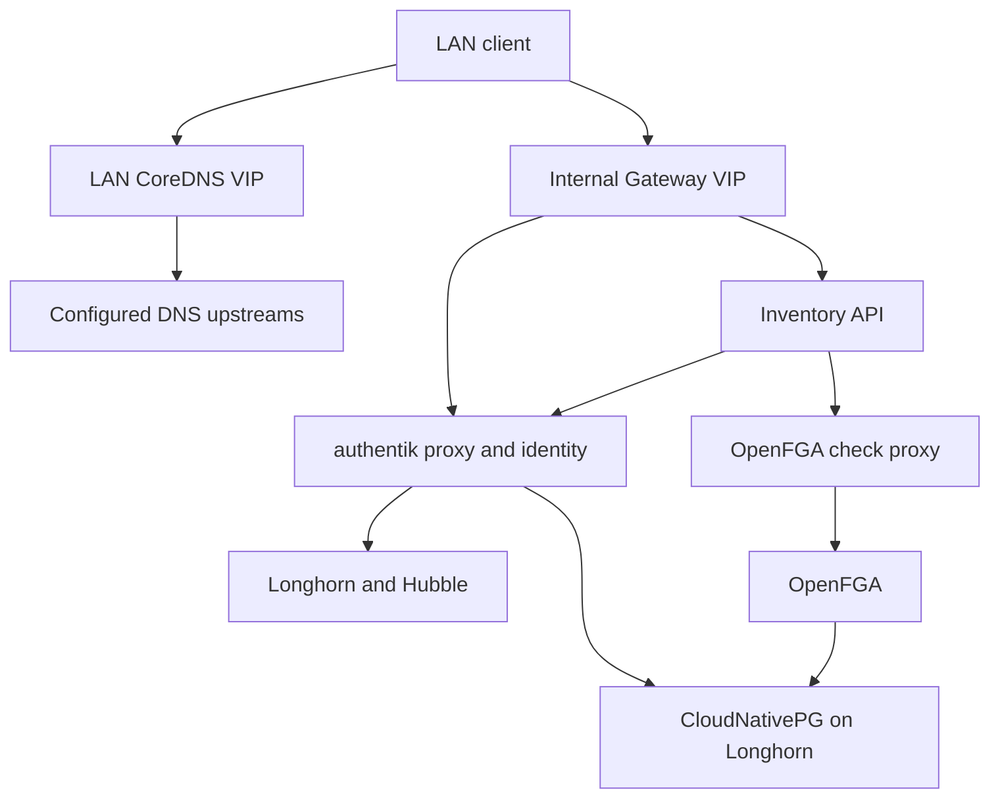

# Architecture and decisions

The base assumes one IPv4 Ethernet LAN/broadcast domain. Node addresses and three service addresses must be stable and unused by other devices. No upstream static routes, BGP, router replacement or DHCP changes are required for client access: configure clients to use the resolver or a split DNS rule.

Cilium announces the DNS and gateway addresses using ARP from gateway-labelled controller/hybrid nodes. A client therefore sees ordinary neighbors in its subnet. VXLAN carries pod traffic between nodes; the client never needs a route to the pod or Kubernetes Service CIDR. A Cilium leader owns each announced service address; failover requires a functioning Kubernetes API and a surviving eligible gateway node. L2 announcement is currently an upstream beta feature. See [Cilium L2 announcements](https://docs.cilium.io/en/stable/network/l2-announcements/).

The k3s API uses an explicit physical/stable LAN endpoint (`api_address`) so the CNI can start before a Kubernetes LoadBalancer exists. The example selects the first controller. This endpoint is not automatically highly available. For API HA, supply an independently managed LAN VIP/TCP load balancer and include it in every server's TLS SANs; do not make the API endpoint depend on Cilium. The removal script refuses to remove the configured API address until it is moved. Application gateway failover and API endpoint failover are distinct concerns.

Pure controllers have a control-plane taint and `elektro.internal/workload=false`. Cilium and LAN DNS may run there; storage and application workloads select `workload=true`. A controller remains a normal k3s server with kubelet because it must run Cilium/Envoy. An agentless k3s server cannot fulfill this gateway role. Kubernetes RBAC administrators can override scheduling restrictions; these are operational placement rules, not a tenant security boundary.

Bootstrap manually installs the exact Cilium Helm release name, namespace and values that Flux later adopts. Installing Flux first would leave its pods without a CNI. Gateway CRDs come before Cilium; storage and database operators come before their custom resources; databases and certificates come before identity. `prune: false` protects the CNI, storage operator, Gateway CRDs and databases from accidental deletion through Git edits. It does not replace backups.

Longhorn's normal volumes use the configured replica count. PostgreSQL has its own three-instance replication, so `longhorn-postgres` stores one Longhorn replica per PostgreSQL instance. Strict PostgreSQL pod anti-affinity spreads those instances across workload nodes. This avoids nine copies of every database block; verify actual replica placement and failure behavior during acceptance. `Retain` keeps volumes after accidental claim deletion.

The base is intentionally IPv4. AAAA queries for internal names return an empty answer; IPv6 requires an explicit dual-stack design. Internal HTTPS uses a private CA because public ACME issuers cannot issue certificates for `.internal`. The CA is generated on the administrator workstation and needs an offline backup.

OpenFGA is authorization infrastructure, not an identity provider. Its authenticated administrative API has no public route. Only a small, fixed-store/model check proxy is reachable by the inventory API, so that application does not receive a credential capable of editing permissions.

The public-domain Gateway is opt-in and has no default routes. Namespaces must explicitly gain `gateway.external/access=true`. A public DNS name alone does not make the LAN reachable from the Internet; WAN publication requires an existing reverse proxy, NAT or tunnel configured by the site owner.
